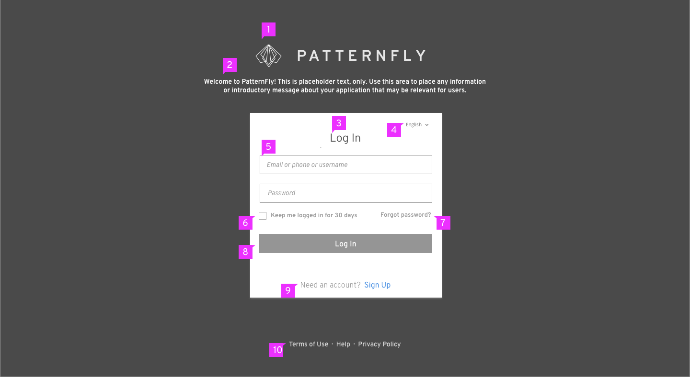
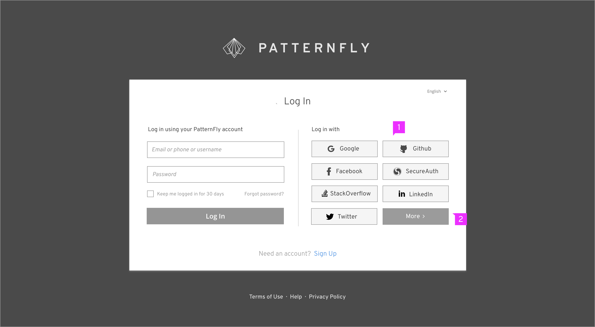
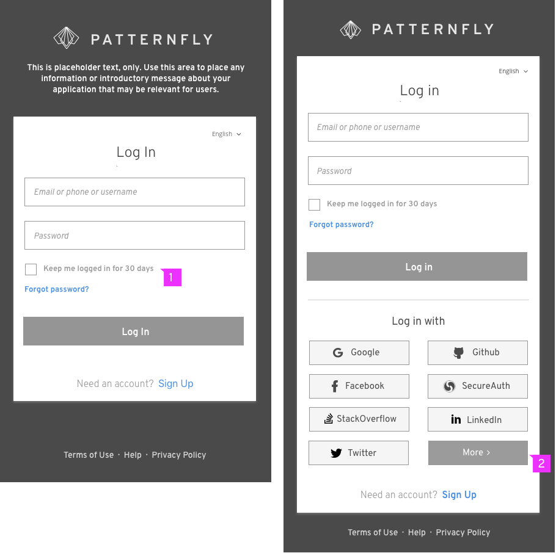
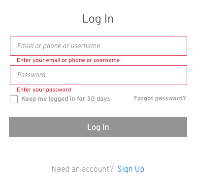
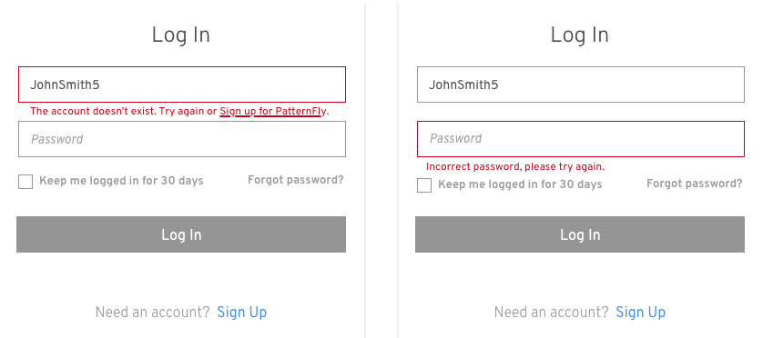
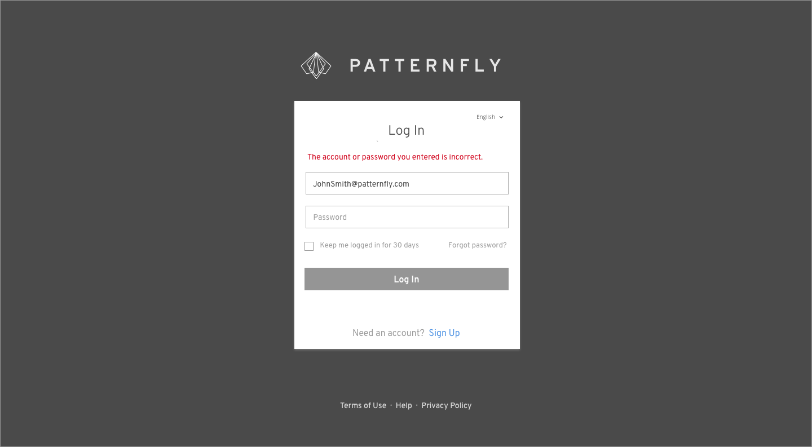
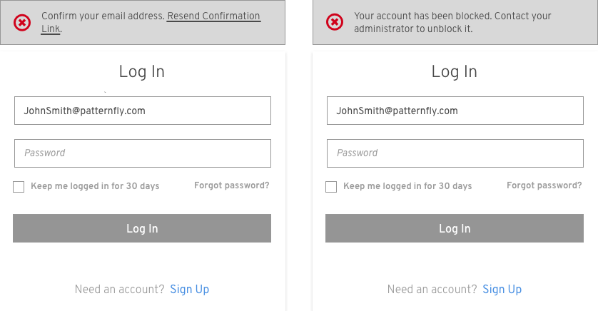

# Login Page

Jump to [Login Pages](#login-pages), [Login Pages | Responsive State](#responsive-state), [Error Messages](#error-messages), or [Notifications](#notifications)

## Login Pages

Jump to [Basic Login Page](#basic-login-page), [Identity First](#identity-first), [Social Login](#social-login), [Other Login Methods](#other-login-methods), or [Single Sign-on (SSO)](#single-sign-on-sso)

### Basic Login Page

1. **Logotype**: The product logo is placed at the top.
2. **Description** (optional): Description of the website can be placed here.
3. **Title**: The title is located at the top of the login card.
4. **Required Fields**: Username and password are the required fields while additional fields are optional. Some applications may require additional fields such as a specific server or geo-location. When additional fields are required, they can appear underneath the password field. The login card will expand to accommodate the additional fields.
The additional fields order will be addressed on a case-by-case basis, but they should sit between the “Password field” and the “checkbox”. Try to limit the number of the fields to less than five. Also, you may use progressive disclosure if the field value have dependency on the previous relevant field.
5.  **Checkbox** (optional): Checkbox is located under the Required fields. It can be labeled varied texts depending on the needs of different applications. Checkbox labels should be capitalized according to [Terminology and Wording Style Guide](http://www.patternfly.org/styles/terminology-and-wording/).
6. **Help Link** (optional): It is a link for users to recover their password.
7. **Login Button**: The button should be labeled "Log In". See the [Terminology and Wording Style Guide](http://www.patternfly.org/styles/terminology-and-wording/) for more information.
8. **Sign up** (optional): The page will jump to the sign up flow after clicking the “Sign up” link.
9. **Language Selector** (optional): The language selector is located under the login card.
10. **Links**: The links are entrance for users to get information and helps.

### Identity First

1. **Username Field**: Include only a username field as the password will be requested in a separate step.
2. **Next Button**: Replace "Log In" with "Next" since this will be a two step process. When the user clicks the "Next" button, the software will validate that this user exists and they will then be prompted to enter a password. If this user does not exist, an error message should be returned.

1. **Validated Username**: After successful verification, the username should change to read-only mode in this page.
2. **Edit**: Users can change username by clicking the edit icon on the far right. After clicking the icon, the card will return to the text field mode as the previous page.
3. **Password Field**: If needed, users should input password to log in.
4. **Login Button**: If there are more steps for authentication, the button should be called “Next” instead of “Log In”.

### Social Login

1. **Social Media Buttons**: When the number of buttons is four or less, display all buttons in one column. Otherwise, use a two-column layout.

### Other Login Methods

1. **Authentication Code**: User can bind the authenticator which installed on their mobile phones with their accounts in registration process. If so, they can login with the code that authenticators provide.
2. **SMS**: Users can bind their phone number (or backup phone numbers) with their accounts in registration process. If so, they can login with SMS.
3. **Backup Code**: A backup code (random strings) can be provided to users in registration process. If so, they can login with backup code.

### Single Sign-on (SSO)

1. **Logotype**: Company logo is located at the top.
2. **Title**: The title is located at the top of the login card.
3. **Description**: <Application> is the one user came from. This page will jump back to that application when finishing the login process.
4. **Supported Services**: All the supported services logo will be displayed at the bottom.

## Login Pages | Responsive State
This section is talking about how the login pages look on small screens.

1. When the screen getting smaller, the help link will automatically moved to the next line if there isn’t enough space for checkbox and help link placed in the same line.
2. When the screen getting smaller,  the links will automatically moved to the next line if there isn’t enough space for language selector and other links.
3. Social media buttons should line up in one column.

## Error Messages
User input can be validated on the client and on the server. With client-side validation, error message will be presented before form submitted. It could happen when the text field gains focus, loses focus, or when user clicks the action button (without calling backend authenticator). With server-side validation, error message will only be presented when the page is reloaded with the data user submitted.

Jump to [Client-side Errors](#client-side-errors) or [Server-side Errors](#server-side-errors)

### Client-side Errors
In most cases, client-side validations perform as inline validations for each field. Some common conditions are as follows.

#### Field(s) is empty

1. **When to Show**: When the user clicks the action button (Log In/Next), the errors must be corrected before the form can be submitted, and an error message will be displayed below any empty field.
2. **When to Hide**: When the user fills the empty field, the error message will disappear when the field loses focus.
3. **Recommended Message**:
  - When the username field is empty, we recommend to show “Enter your username”. “Username” can be replaced by “email” or other words if username is restricted to specific types of words.
  - When the password field is empty, we recommend to show “Enter your password” if a password is needed.

#### Invalid Characters

1. **When to Show**: When user clicks the action button (Log in/Next), the login form can’t be submitted and error message will show (below the username field) if there are invalid characters in username.
2. **When to Hide**: After user modified the field, the error message will disappear when the field loses focus.
3. **Recommended Message**:
	- What characters are invalid determined by the username type: email address, phone number or custom username.
	- If the username can only be email address and/or phone number, we recommend to show “That doesn’t look like an email address or phone number” when there are invalid characters.
	- If the username can also be customized, when there are invalid characters, show “Invalid characters”.

#### Caps lock is on

1. **When to Show**: When the password field gets focus as well as caps lock is on, an error message will show up to warn users to avoid making mistake.
2. **When to Hide**: Once the caps lock turns off, the warning message should disappear.
3. **Recommended Message**: "Caps lock is currently on. This may cause you to type an incorrect password."

### Server-side Errors
When users submit the form, the entire page is reloaded with indications of validation errors. At the same time, the password field should be cleared due to the security reason. Error messages can perform as inline validations for each field or inline notifications as global messages. Inline Notifications are displayed below the application name and above the input fields. If there are multiple messages, each message appears on its own line, and the area adjusts as needed to fit these messages.

#### Account doesn’t exist/password is wrong
If the user input a wrong account name which do not exist or if the user input a wrong password, we provide two solutions to show error messages:

1. Directly tell the user that the account doesn’t exist or the password is wrong. Although it is useful and clear for user to easily understand the problem, it’s not safe.

 - When username is wrong (doesn’t exist), we recommend to show:
  - "The account doesn’t exist. Try again."
  - “The account doesn’t exist. Try again or Sign up for PatternFly.” for the products supporting signing up. The “Sign up for PatternFly” should be a link to help users creating a new account more easier. “PatternFly” can be replaced with other product names.
 - When password is wrong, we recommend to show “Incorrect password, please try again.”

2. For security reasons, just tell user that the username and the password don’t match.

#### User input an old password
If the user input an old password (they may have changed the password recently), we can show an error message alerting them that the password has changed instead of stating “the password is wrong” only.

#### Other Examples of Error Messages

## Notifications
Except for error messages, notifications can also be informational messages. An informational message is triggered if the user is timed out of the application. They will be returned to the login page, which will display an informational message explaining that the session timed out due to inactivity.

