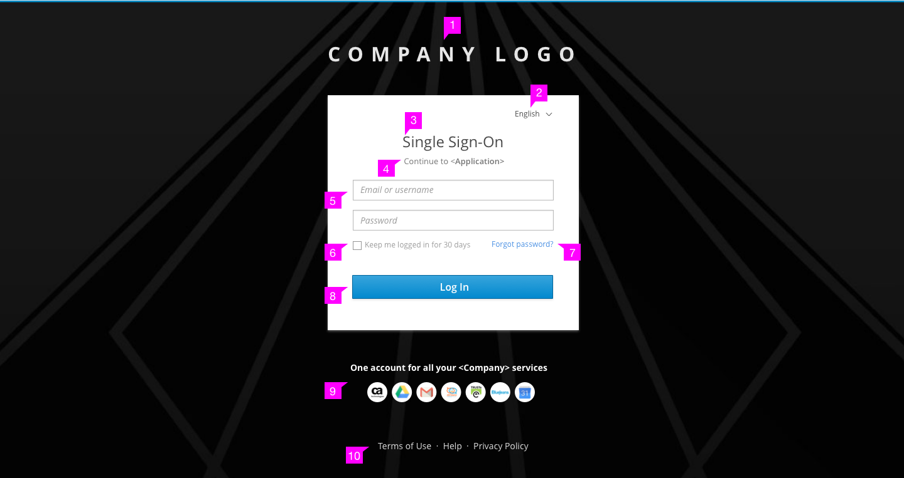
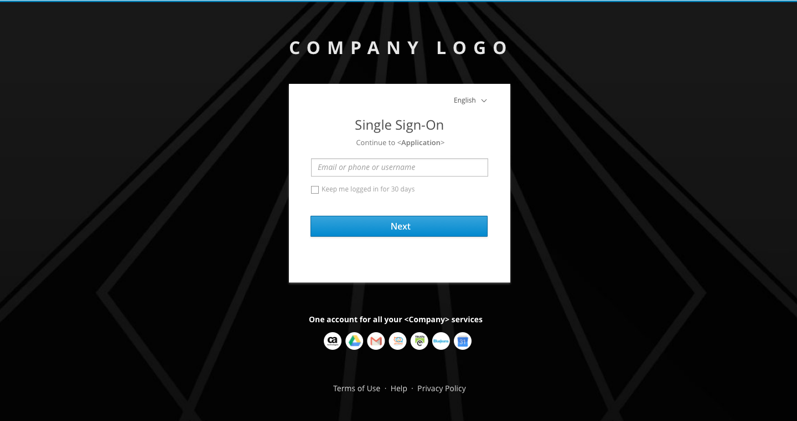
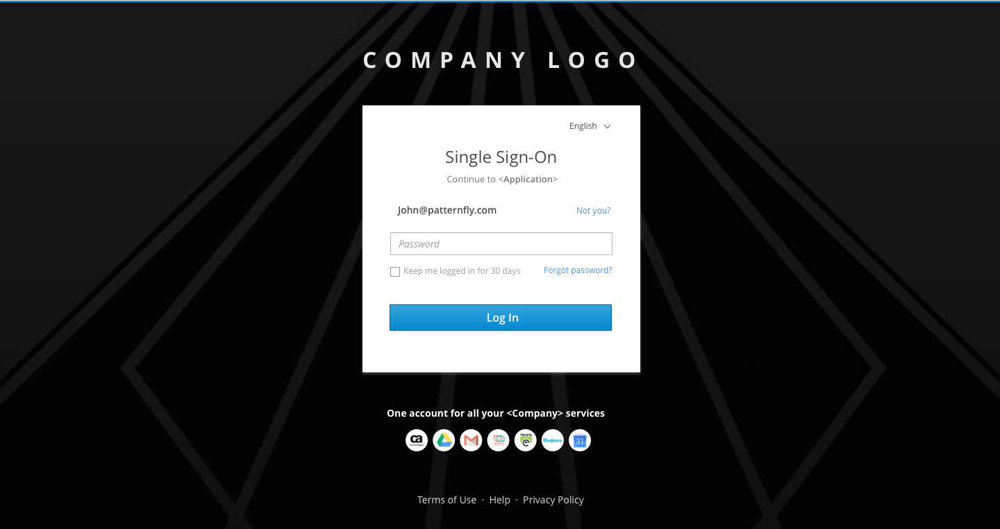

# Single Sign-On (SSO)

1. **Logotype**: Company logo is located at the top.
2. **Language Selector** (optional): The language selector is located in the top right of the login card.
3. **Title**: The title is located at the top of the login card.
4. **Description**: "Application" is the one user came from. This page will jump back to that application when finishing the login process.
5. **Required Fields**: Username and password are the required fields while additional fields are optional. Some applications may require additional fields such as a specific server or geo-location. When additional fields are required, they can appear underneath the password field. The login card will expand to accommodate the additional fields. The additional fields order will be addressed on a case-by-case basis, but they should sit between the “Password field” and the “checkbox”. Try to limit the number of the fields to less than five. Also, you may use progressive disclosure if the field value have dependency on the previous relevant field.
6. **Checkbox** (optional): Checkbox is located under the Required fields. It can be labeled varied texts depending on the needs of different applications. Checkbox labels should be capitalized according to [Terminology and Wording Style Guide](http://www.patternfly.org/styles/terminology-and-wording/).
7. **Help Link** (optional): It is a link for users to recover their password.
8. **Login Button**: The button should be labeled "Log In". See the [Terminology and Wording Style Guide](http://www.patternfly.org/styles/terminology-and-wording/) for more information.
9. **Supported Services**: All the supported services logo will be displayed at the bottom.
10. **Links** (optional): You may add any additional links to pages where the user can get more information or help.

## Identity First
User can also be authenticated step by step when login with SSO. The login process are similar to [Multi-Factor Login](https://www.patternfly.org/pattern-library/application-framework/multi-factor-login/#).

