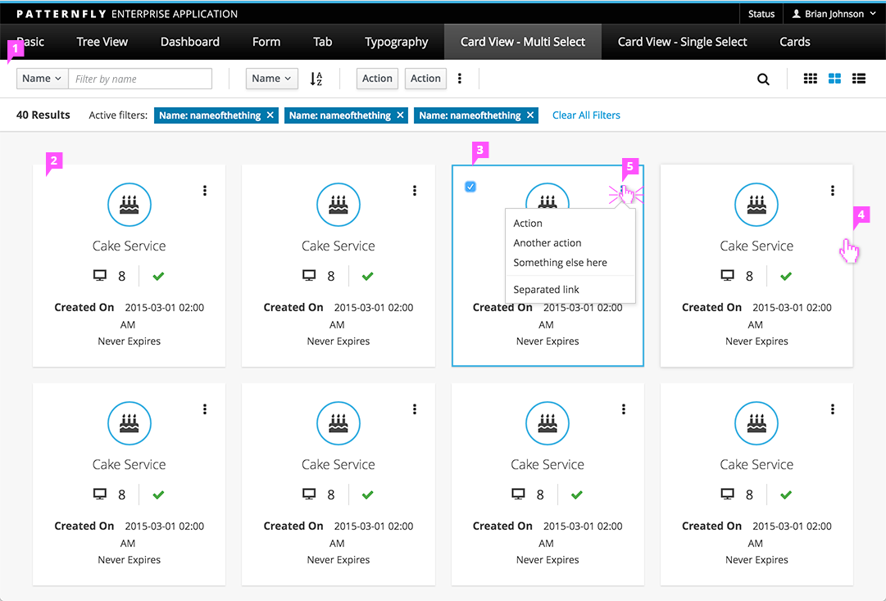

# Card View

## Description

1. Toolbar: The [Toolbar](https://www.patternfly.org/pattern-library/forms-and-controls/toolbar/#_) pattern may include filter, sort, actions, find and change view type. If the user can add new objects that will appear in the view, and Add action should be included here.
1. Card: The card is a container for displaying content about an object. At a minimum each card should be uniquely identified with the name of the object that it represents.
  - Each Card should have the same layout:
    - When including titles, Make the title bold rather than appending a colon ( : )
    - Links may be displayed within a card
  - When the viewport size is decreased:
    - The number of cards in each row may decrease
  - Use tooltips as necessary.
1. Selection:
  - When only single-select is supported, a user can drill down on a card by clicking on it.
  - If multi-select is supported, a checkbox will be displayed when the user hovers over a card. When it is clicked, that card is selected which is indicated by the check mark in the checkbox as well as a blue outline on the card. The selected checkbox will be shown as long as the card remains selected. Actions in the Toolbar apply to all selected cards.
  - For multi-select on mobile devices, checkboxes should be displayed at all times, and should use the device default checkbox rather than the patternfly checkbox.
1. Card Hover: A visual indication is shown when the user hovers over a card.
1. Inline Actions: Inline actions should be included if the user needs to be able to quickly perform an action on a single card. Very large numbers of actions should be placed in the Actions section of the Toolbar rather than on the card. See [Card Variation Examples](https://www.patternfly.org/pattern-library/content-views/card-view/#/api) for some ways that you may represent inline actions on cards.

## Additional Notes about Behavior

- Empty State: If no cards exist to be displayed, display an Empty State page. See the [Empty State](https://www.patternfly.org/pattern-library/communication/empty-state/#_) pattern for more details.
- Vertical Scroll: Use a vertical scrollbar as needed. A horizontal scrollbar should NOT be used. Instead, the page containing the Card View should be responsive.
