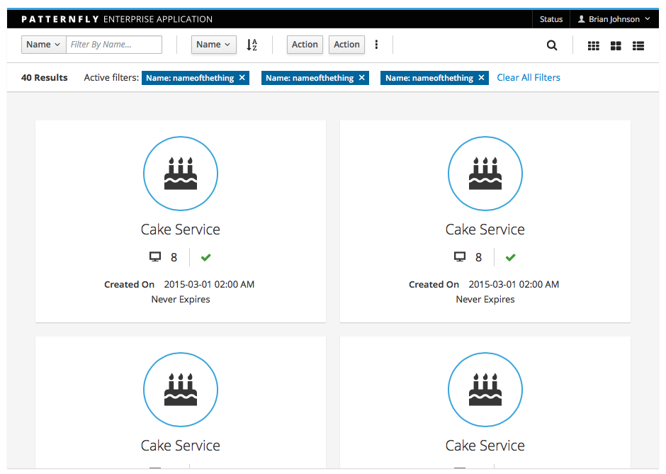
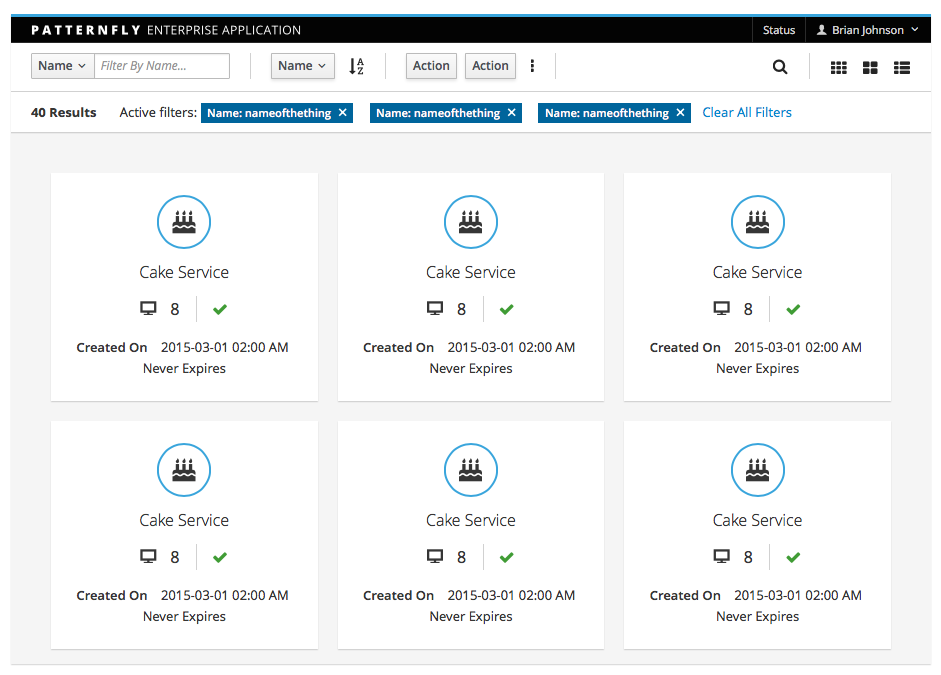
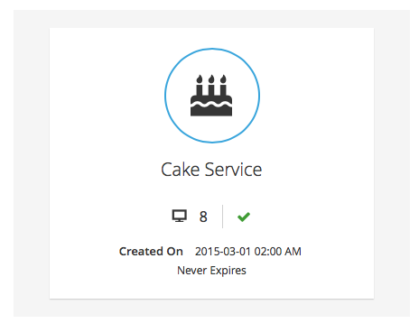
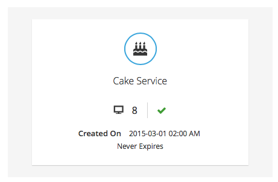
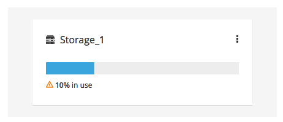
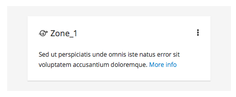

# Card View

Card View organizes content into a grid of cards. Card View is useful for displaying a small to moderate amount of content in a way that is not visually overwhelming. If the pieces of content to be displayed are best identified by a graphic or other visual representation, Card View enables a user to easily visualize and compare them. It is also useful when you want to present a large number of objects at once within the same summary page.

The Card View should NOT be used if:

- Users need to quickly scan a large amount of text-based content. Consider using a [Table View](https://www.patternfly.org/pattern-library/content-views/table-view/#_).
- You want to display more content about each object that can fit into a small tile. Consider using a [List View](https://www.patternfly.org/pattern-library/content-views/list-view/#/api).

Jump to [Single-Select Card View](https://www.patternfly.org/pattern-library/content-views/card-view/#/single-select), [Multi-Select Card View](https://www.patternfly.org/pattern-library/content-views/card-view/#/multi-select) or [Card Variation Examples](https://www.patternfly.org/pattern-library/content-views/card-view/#/card-variations).

## Single-Select Card View

[View full page example](https://www.patternfly.org/pattern-library/content-views/card-view/card-view-single-select.html#_)

## Multi-Select Card View

[View full page example](https://www.patternfly.org/pattern-library/content-views/card-view/card-view-multi-select.html#_)

## Card Variation Examples

The following card variations provide some examples of how you might visualize content within a card. You are not limited to these layouts. You may need to adjust the visualizations and/or combine elements to best fit your application’s needs. Each card within a card view should have a consistent layout. Do not mix and match.

### Large Card

When you have fewer cards and more space to work with, you may consider a larger card option that also shows some status and additional information.

### Small Card

If you have many cards and space is tighter, use the smaller card option.

### Mini Card with status

Use when you want to display many objects within a grid layout. Any inline actions should be hidden in an actions menu placed in the upper right corner of the card. Status can be reflected through a status icon preceding object name (title) and or a single chart graphic. The bar graph is used here because of its small vertical footprint.

### Mini Card with text

Alternatively include a small amount of text based content within the card with links. Inline actions accessible from the actions menu.

