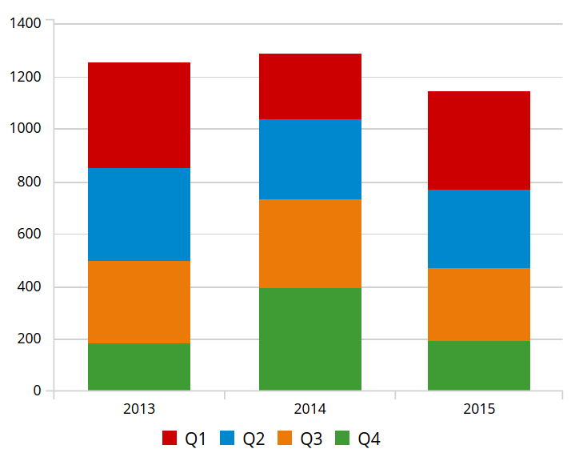
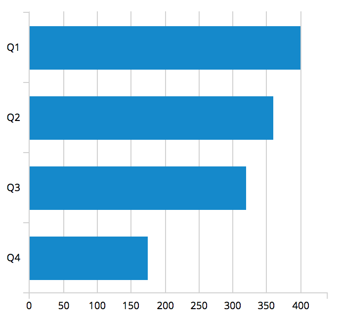

# Bar Chart

## Overview
Bar charts are used to visualize quantitative data. Since bar charts differentiate by length, we recommend that in most cases they be used rather than donut or pie charts, which differentiate by angle and area. As a rule of thumb, bar charts are a great way to show and compare categorical data. If you want to show continuous data over time, you may consider using a line chart instead. If you wish to show the percentage utilization ratio between used and available, you should check out the [Utilization Bar Chart pattern](https://www.patternfly.org/pattern-library/data-visualization/utilization-bar-chart).

Jump to [Vertical Bar Chart](#vertical-bar-chart), [Grouped Vertical Bar Chart](#grouped-vertical-bar-chart), [Horizontal Bar Chart](#horizontal-bar-chart) or [Grouped Horizontal Bar Chart](#grouped-horizontal-bar-chart)

## Examples

### Vertical Bar Chart

### Grouped Vertical Bar Chart

### Horizontal Bar Chart

### Grouped Horizontal Bar Chart

