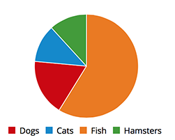
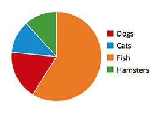
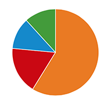
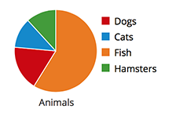

# Pie Chart

Pie charts are commonly used to show percentages or proportional data. Sections within a pie chart may be hard to compare to each other so you should use a pie chart when you want to compare an individual section to the whole. If you wish to show the exact value of each data point, please check out the [Bar Chart pattern](https://www.patternfly.org/pattern-library/data-visualization/bar-chart).

On hover, the percentage value of each section is provided in a tooltip. The pieces of a pie chart must add up to 100%. It is recommended that there are no more than six categories per single pie chart. 

Jump to [Pie Chart with Bottom Legend](#pie-chart-with-bottom-legend), [Pie Chart with Right Legend](#pie-chart-with-right-legend), [Pie Chart with No Legend](#pie-chart-with-no-legend), or [Small Pie Chart with Label](#small-pie-chart-with-label)

## Pie Chart with Bottom Legend

## Pie Chart with Right Legend

## Pie Chart with No Legend

## Small Pie Chart with Label

