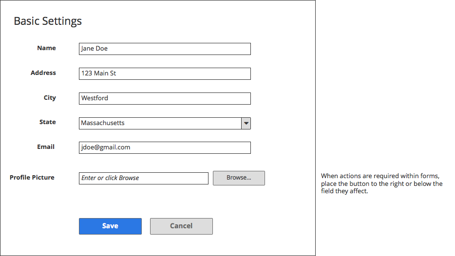

## Actions

### High-Level Recommendations

* Align submit buttons to the left (Save, Cancel) on full page forms and to the right (Cancel, Save) on modals.

* Buttons within forms should be placed immediately to the right of or below the item that they affect.

* Disable submit buttons until all required form inputs have been satisfied.

### Buttons on Forms
Buttons are the primary means for invoking actions within forms.  Submit buttons are generally placed at the bottom of the page to optimize top to bottom flow.  There should always be two buttons, a primary action button that will commit changes made by the user and a Cancel button that will abort those changes.  By default, the primary action will be labeled Save unless there is use case specific naming that makes more sense.  The Cancel button should always discard any changes and return the user to their prior state before opening this form (i.e., close the modal window or navigation back to the parent page.)  See the [PatternFly Terminology and Wording guidelines](http://www.patternfly.org/styles/terminology-and-wording/#_) for more guidance on button labeling.

For full page forms, submit buttons should be left aligned at the bottom of the page. Left align buttons with the left edge of the input fields with the primary action on the left.  

On modal forms, the button are right aligned with the primary action as the right most button.

Buttons may also be used for actions within a form.  In these cases, the button should be placed to the right of or below the item that they affect.

[Link to button style guidelines for more detail about button appearance.]

#### Enabling and Disabling Actions
Submit buttons should be disabled when all conditions required for completing a form are not met.  This will reduce the need to return validation errors because the user neglected to complete the form.  When using disabled buttons, it should always be possible for the user to enable the button by inputing information onto the current page.  Do not use this technique for blocking functionality that is not available to the current user or requires changes outside of the current page.

#### Usage Guidelines

  1. **Close Button:**
    - For modal dialogs, follow the [Modal Widget](https://www.patternfly.org/pattern-library/widgets/#modal) guidelines.
    - When referring to closing another type of view use "Close" as a secondary button.

  1. **Delete Button:**
   - "Delete" should be used in a secondary button unless you have a limited use case where the Delete action is a highly destructive action. In that case, use the destructive button. Ideally, a delete button would be followed up with a confirmation modal for the user to confirm this action.

  1. **Cancel Button:**
   - "Cancel" should be used in a secondary button unless you have a limited use case where the Cancel action is a highly destructive action. In that case, use the destructive button.
