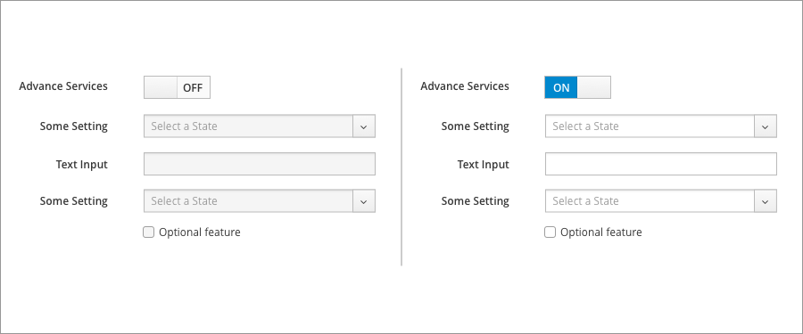
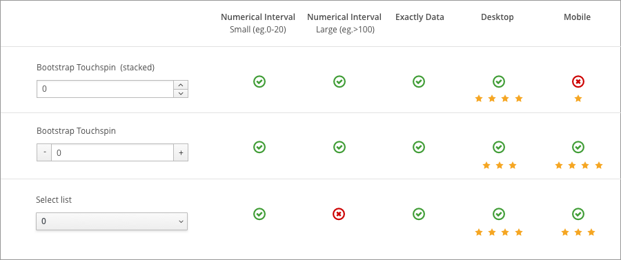
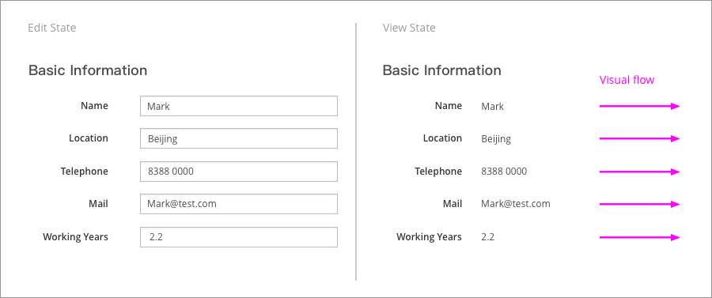

# Data Input

## Selection Controls

### Overview
You should choose a selection control pattern based on the number of choices available to the user.
* Use **radio buttons** or **checkboxes** when you need to select from 2 to 5 known choices.
* When there are more than 5 choices, when layout space is limited, or when there are variable choices, use a **Select list**.
* Use a **Switch** input to allow the user to toggle between enabled and disabled states.

Implement these patterns in a well-structured layout to avoid visual clutter.

### Details

#### Checkboxes
You should use Checkboxes when users need to select one or more items from a list of known options. When it's possible, arrange checkboxes vertically to facilitate easy visual scanning. If there are many items and labels are short, use a multi-column grid arrangement to save vertical space.

If necessary, you can nest other controls within a checkbox item. Enable and disable nested options when the user selects or unselects a check box.

1. Checkboxes arranged in a two-column grid to conserve vertical space
2. Checkboxes with nested controls

#### Radio Buttons
Radio buttons allow users to make mutually exclusive selections. You must include more than one radio button in a group, and only one selection can be active at a time.

To allow users to select a null option, use "None" or a similar term to represent that choice.

You may arrange radio button vertically or horizontally according to your preference. However, vertically-arranged radio buttons are easier for users to scan.

Like checkboxes, you can use radio buttons to nest other controls , following the same guidelines for enabling or disabling options.

As a general rule, you shouldn't use radio buttons when more than 2-5 options are available or if there are space constraints. In these cases, try using a [Select list](#select-lists) instead.

1. A horizontal group of radio buttons
2. A vertical group of radio buttons with nested controls

#### On/Off Switches
Use an On/Off switch when a user is presented with the binary choice to enable or disable some optional attribute or capability. In such a case, switches are excellent alternatives to a single checkbox or set of two radio buttons.

Since the switch pattern is only used to enable or disable an attribute, you can simply labeling when using a switch by using only the name of the affected attribute. If the options you're presenting to the user are anything other than "on" or "off," you should use radio buttons instead.

Just like radio buttons and checkboxes, switches can be used to enable or disable a set of nested controls.

#### Select Lists
You should use select lists when there are more than 5 known options, or when space is too limited for radio buttons. Select list should also be used when options are dynamic or variable.

PatternFly offers two types of Select controls, Bootstrap Single Select and Bootstrap Multi Select.
* Use Bootstrap Single Select for selecting a single, mutually exclusive option.
* Use Bootstrap Multi Select for selecting one or more options.

When fewer than five options exist, you should use radio buttons or checkboxes to display all options to the user simultaneously.

#### Comboboxes
A combobox allows users to type a value into the field *or* select a predefined option from the dropdown list. Comboboxes also support type-ahead features– a filtered list of options is displayed as the user types. This makes it easier to select a preferred option when there are too many options to quickly scan the full list.

You should use a combobox in place of a single select list when there are more than 10 options.

## Data Entry Controls
You should choose a data entry control pattern that is optimized for the type of data a user will input. In some cases, users may need to select from a fixed set of options. In other cases, they may need to input a value directly.
* Use *bound-entry controls* like the **Date Picker**, **Time Picker**, or **Touchspin** when entering strictly-typed data. This will reduce the need for field-level validation and prevent user input errors.

When implementing these patterns, you should take notice of the alignment of data. Consider data comparison and visual flow when deciding to left or right-align data entry controls.

### Details

#### Text Entry
Text fields are common, simple inputs for allowing a user to enter a string of characters from the keyboard. Be sure to size text fields appropriately to anticipate the longest likely value (if a maximum character length is known). When a value is too long to be fully displayed in a text field, use [truncation](http://www.patternfly.org/styles/terminology-and-wording/#_).

If users must enter specifically-formatted data into the text field, use syntax hints and field validation to prevent data entry errors.

#### Bound Entry Controls
Use bound entry controls should be used to enter special data types, such as dates, times, and other numeric data. Bound entry controls constrain user input and combine keyboard and mouse interaction. These controls are designed to only allow valid inputs. As a result, field validation is unnecessary. See the [Datepicker](http://www.patternfly.org/pattern-library/forms-and-controls/datepicker/), [Timepicker](http://www.patternfly.org/pattern-library/forms-and-controls/timepicker/), and [Bootstrap Touchspin](http://www.patternfly.org/pattern-library/widgets/#bootstrap-touchspin) components for details.

The dialog box above uses bounded data entry controls to prevent user errors. A date picker, time picker, touchspin control, and select list are used to input properly-formatted data into the form.

#### Bootstrap Touchspin
PatternFly provides two kinds of [Bootstrap Touchspin](http://www.patternfly.org/pattern-library/widgets/#bootstrap-touchspin) controls. The Bootstrap Touchspin with stacked buttons is the preferred method for entering numeric data on a web form. The user has a lot of user experience with this pattern, but the control buttons are too small on mobile devices, will be very hard to click, and may lead to input errors . If your application needs to adapt to small screen devices, you should avoid using the Bootstrap Touchspin (stacked) control.

An alternative is to use the Bootstrap Touchspin (without stacked). When using this control, the width of field will have a huge influence on user experience. Too wide a field will make it frustrating for users to click the control buttons. In this case, it would better adjust the width of input fields to match the length of the expected input.

#### Bootstrap Select
[Bootstrap Select]( http://www.patternfly.org/pattern-library/widgets/#bootstrap-select) can also be used to enter numeric data. This pattern helps users select a value quickly and accurately, preventing user input errors. This is especially true in the usage scenarios for selecting data from some special data group (eg. -20 / -10 / -5 / 0 / 5 / 10 / 20).

When using a select list, options should be less than 20. Long lists that require scrolling are not easy to operate on mobile devices.

#### Left-alignment or right-alignment
When you're deciding to left or right-align data in an entry control, consider the context of the data, the type of data, and the type of input.

##### Left alignment
Users generally scan information from left to right, moving from the top of a section to the bottom. Left-aligning information can make it easier for users to move easily from one line of data to the next by providing a consistent starting point for each line.

##### Right alignment
Right-aligning integer strings allows the numbers to be easily compared, as decimals and comma separators are aligned. This increases contrast between lines of data.

Right-alignment is most important for pure numeric values and decimal values, because users can easily scan the values. Right-aligned data also supports increased number legibility in table layouts.

###### Tips:
You should keep in mind that right-aligned numeric text entry fields may be difficult to edit once the user has inputted a value. The user would be forced to click within the small space between the end of the number value and the right end of the field to add digits to the value. This is even more difficult on touchscreen interfaces.
