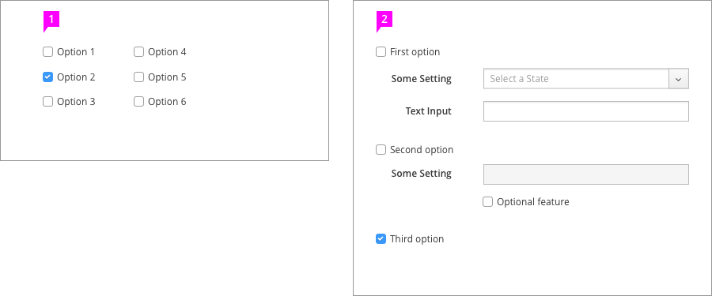
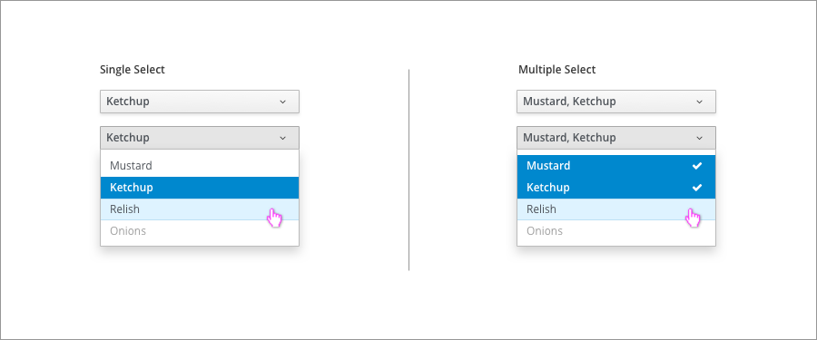
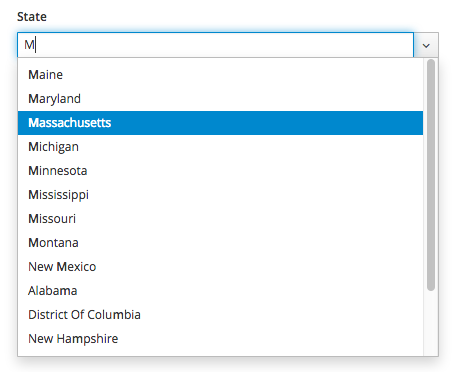
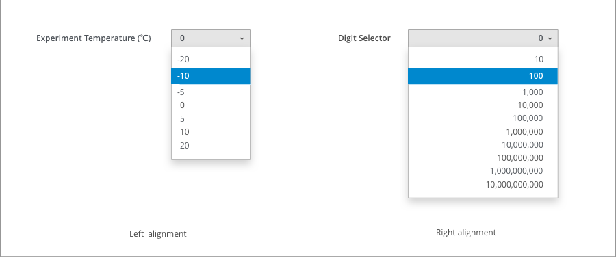

# Data Input

## High-Level Recommendations
#### Selection Controls
* Use radio button or checkboxes when you need to select from a small number of known options (2-5 options).  They provide users with the best visibility to choices.

* Select lists can be used when you have many options, are space-constrained, or  have variable options.

* On/off switches are a good alternative for enabling and disabling capabilities, but they should be used sparingly to reduce visual clutter.

#### Data Entry Controls
* Use bound entry controls like datapickers, timepickers, or numeric touchspin  controls when entering strictly typed data.  This will reduce the need for field-level validation and prevent user input errors.

* Using the [Bootstrap Touchspin](http://www.patternfly.org/pattern-library/widgets/#bootstrap-touchspin) component in the Widgets library for numeric data entry is a good choice on forms. The user could enter the numeric data directly from the keyboard or use the “+””-” buttons for fine tuning. Bootstrap Touchspin could adjust number automatically prevent user input errors.

* When the list of possible values is less than 20, a select list can also be used to enter numeric data.

Forms enable users to input a variety of data.  Users may need to select from a fixed set of options or input a value directly.  Guidelines for selection from multiple options and entering values from the keyboard are included below.

## Selection Controls

### Using Checkboxes, Radio Buttons, and Switches
Checkboxes, radio buttons, and switches are useful when you want to select from a list of optional settings.  

#### Checkboxes
Checkboxes should be used when allowing users to select one or more items from a list of options. Arrange checkboxes vertically, when possible to facilitate easy scanning.  If there are many items and labels are short, a grid arrangement can also be used to save space.  You may also nest other controls within a radio button group that are enabled or disabled when an option is selected/deselected.

1. Checkboxes arranged in a two-column grid
2. Checkboxes with nested controls

#### Radio Buttons
Radio buttons allow mutually exclusive selection.  Radio buttons are always used as a group and there will always be one (and only one) active selection.  If you need to alow selection of a null option, use "None" or a similar term to represent that setting.  You may arrange radio button vertically or horizontally, although vertical arrangement is preferrable for scanning.  Radio buttons, like checkboxes, may also be used to nest other controls for enabling or disabling options.

As a general rule, radio buttons should not be used when more than 2-5 options are available or if you are space constrained.  In these cases a [Select list](#select-lists) is a better choice.

1. A group of radio buttons arranged inline
2. A vertical radio button group with nested controls

#### On/Off Switches
On/Off switches are a third option and can potentially take the place of a single checkbox or a set of two radio buttons.  Switches should only be used when the result will be to enable or disable some optional capability.  They may simplify labeling by allowing you to simply label the on/off switch with the name of the attribute being affected.  For general option selection, checkboxes should be the default choice.  Like checkboxes, switches can be used to enable or disable a set of nested controls.

### Select Lists
Select lists provide an alternate method for selecting between multiple options when space is constrained or there are too many options to comfortable display on the page at once.  Select list should also be used when the options may vary.

PatternFly offers two types of Select controls, Bootstrap Single Select for selecting between mutually exclusive options and Bootstrap Multi Select for selecting one or more options from a list.  When a small number of options exist, radio buttons or checkboxes are preferred over select lists as they serve to make all the options visible.

### Comboboxes
A combobox is similar to a single select list in that users can select from a dropdown list of pre-defined options.  However, a combobox combines a text input field with the dropdown list allowing users to enter the value from the keyboard or select it from the list.  Comboboxes also support type-ahead so that a filtered version of the value list is displayed as the user types, making it easier to select from a filtered set of options. A combobox is preferred over a select list when the number of options is large (more that 10).

## Data Entry Controls

### Text Entry
Text edit fields are the simplest and most common controls for allowing a user to enter a string of characters from the keyboard.  Edit fields should be appropriately sized to anticipate the longest value possible (if a maximum character length is known).  In cases where a value is too long to be fully displayed in an edit box, [truncation](http://www.patternfly.org/styles/terminology-and-wording/#_) should be used.

If the acceptable entries into a text edit field are constrained, syntax hints and field validation are recommended to prevent data entry errors.

### Bound Entry Controls
Bound entry controls should be used when entering special data types, including dates, time, and other forms of numeric data.  These controls constrain user input and combine keyboard and mouse interaction.  They are designed to only allow valid inputs and therefore avoid the need for secondary validation.  See the [Datepicker](http://www.patternfly.org/pattern-library/forms-and-controls/datepicker/), [Timepicker](http://www.patternfly.org/pattern-library/forms-and-controls/timepicker/), and [Bootstrap Touchspin](http://www.patternfly.org/pattern-library/widgets/#bootstrap-touchspin) components for more details.

This dialog box uses bounded data entry controls to prevent user errors.  A date picker allows the user to pick a valid date.  A time picker, a Bootstrap Touchspin control, and a select list control are used to set time, repeats, and participants, respectively.

### Bootstrap Touchspin
PatternFly provides two kinds of [Bootstrap Touchspin](http://www.patternfly.org/pattern-library/widgets/#bootstrap-touchspin) controls. The Bootstrap Touchspin with stacked buttons is the preferred method for entering numeric data on a web form. The user has a lot of user experience with this pattern, but the control buttons are too small on mobile devices,  will be very hard to click, and may lead to input errors . If your application needs to adapt to small screen devices, you should avoid using the  Bootstrap Touchspin (stacked) control.

An alternative is to use the Bootstrap Touchspin (without stacked). When using this control, the width of field will have a huge influence on user experience. Too wide a field will make it frustrating for users to click the control buttons. In this case, it would better adjust the width of input fields to match the length of the expected input.

### Bootstrap Select
[Bootstrap Select]( http://www.patternfly.org/pattern-library/widgets/#bootstrap-select) can also be used to enter numeric data. This pattern helps users select a value quickly and accurately, preventing user input errors. This is especially true in the usage scenarios for selecting data from some special data group (eg. -20 / -10 / -5 / 0 / 5 / 10 / 20).

When using a select list, options should be less than 20. Long lists that require scrolling are not easy to operate on mobile devices.

