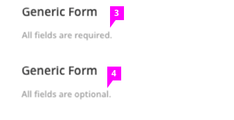

## Field Labeling

> Right aligned labels should be your default choice.  It has been shown that this approach leads to the shortest completion times.

> Use top aligned labels when you are space constrained or if mobile usage is a high priority.

Labels are always provided for input fields to help users understand what information is being requested of them. This pattern has recommendations for three variations to support different use cases.  Whatever approach you use, we recommend that you maintain consistency throughout an application.

### Top Aligned Labels
Top aligned labels provide a consistent left edge, along with close proximity of label and input. This offers ease of use for both scanning and form completion while requiring more vertical space than the alternatives.

Top aligned labels offer the most horizontal area for long labels, relative to the other options as labels can vary in length without affecting the overall presentation. Because the labels are in close proximity to the input fields this approach supports scanability and quick data entry. But because this approach is so visually efficient, however, users might move too quickly through the form and potentially make data entry errors.

##### Use When
* The ability to complete the form quickly is a high priority.
* When label length might vary, e. g. internationalization support.
* The label length might be long, such as for “natural language” question-style labels.
* The user will be entering familiar content and is less likely to make data entry errors.
* Only a few form fields need to be presented.
* Related fields must be grouped horizontally. For example [first name] [last name]

### Right Aligned Labels
The ragged left edge makes scanning for context difficult, although the proximity between label and input aids quicker form completion.

Right aligned labels are good for layouts with more horizontal space than vertical, and support (western), left to right, reading between label and field. The label and the field are in close proximity, allowing the user to traverse quickly, and the vertical margin between all the labels and inputs might aid scanning in long forms.

Despite these advantages, the irregular, ragged left edge of form labels makes this presentation visually busy and more difficult to scan. Long labels need to wrap to a second line, increasing vertical height and/or disrupting the order of the presentation.

##### Use When
* The user is likely to understand the overall context of the form, and scanability is not a priority.
* Completing the form quickly is a priority, but using the “top-aligned” format is not a viable solution.
* For desktop and tablet interfaces, ensure that there is sufficient margin to the left of the form labels to accommodate most labels.
* To accommodate mobile viewports, right-aligned labels should be responsive by adjusting to a top-aligned layout.

### Left-aligned labels
The strong vertical edge helps users to scan for context, although the distance between label and input might slow users down.

Left aligned labels are good for unfamiliar content or forms in which well considered responses are necessary. Users can easily scan the left edge to read the labels and understand the larger context of the form while the distance between labels and inputs might slow users down. Like right-aligned labels, they support (western), left to right reading between label and field and are good for layouts with more horizontal space than vertical.

##### Use When
* The user is presented with unfamiliar content, and would benefit from scanning the form to understand the overall context.
* The user needs to provide a well considered response - providing data related to critical or complex tasks.
* It’s more important that the user pay close attention to the form material, rather than completing it quickly.
* User needs to be able to make the visual connection between the label and the input; ensure that there isn’t too much space between these elements.
* To accommodate mobile viewports, left-aligned labels should be responsive by adjusting to a top-aligned layout.

### Indicating Required Fields

1. **Required field:** Required fields should be denoted with an * (asterisk) symbol.
  - Due to responsiveness issues, we do not recommend labeling optional fields with "(optional)"
1. Forms with a mixture of required and optional fields should include this explanation.

  

1. Forms in which all fields are required should include this explanation.
1. Forms in which all fields are optional should include this explanation.

### Displaying Units
Where applicable, units should be displayed to the right of any field where they are needed to provide clarity to the displayed data.

[Need an example here.]  
