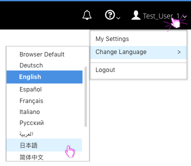
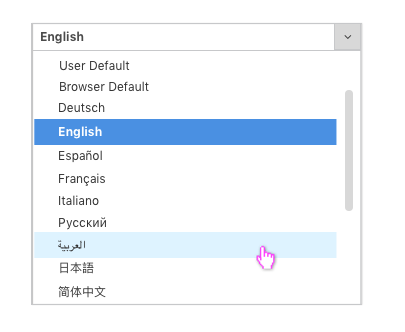

# Language Selector

## Selector Properties
  * **Naming:** All available languages should be listed in the native language. For example, "German" should never exist in the list. Instead, "Deutsch" would appear in this case.
  * **User Default: (optional)** If the Language Selector is being accessed from a login screen, you should include a "User Default" option. This would inherit the language selected by the user on their last session. If available, this option should be the default selection and the first in the list.
  * **Browser Default:** There should always be a “Browser Default” option at the top of the list. If "User Default" is also available, the Browser Default option will be second in the list. When selected, the application should inherit the current browser language being used.
  * **Ordering:** Language names should be listed in alphabetic order following any default options. The list should scroll as needed.
  * **Selecting:** The option or language currently selected should be highlighted for some visual indication. Hovering over another option should also be visually indicated.

## Selector Locations
  * From the [Masthead](https://www.patternfly.org/pattern-library/application-framework/masthead/#_) User section, the selector should be labeled “Change Language.” Hovering over this label should open a list of all available languages.

  

  * From the [Login Page](https://www.patternfly.org/pattern-library/application-framework/login-page/#_), a label reading "Language" should sit to the left of a standard [Combobox](https://www.patternfly.org/pattern-library/widgets/#bootstrap-combobox) for the language selection.

  
