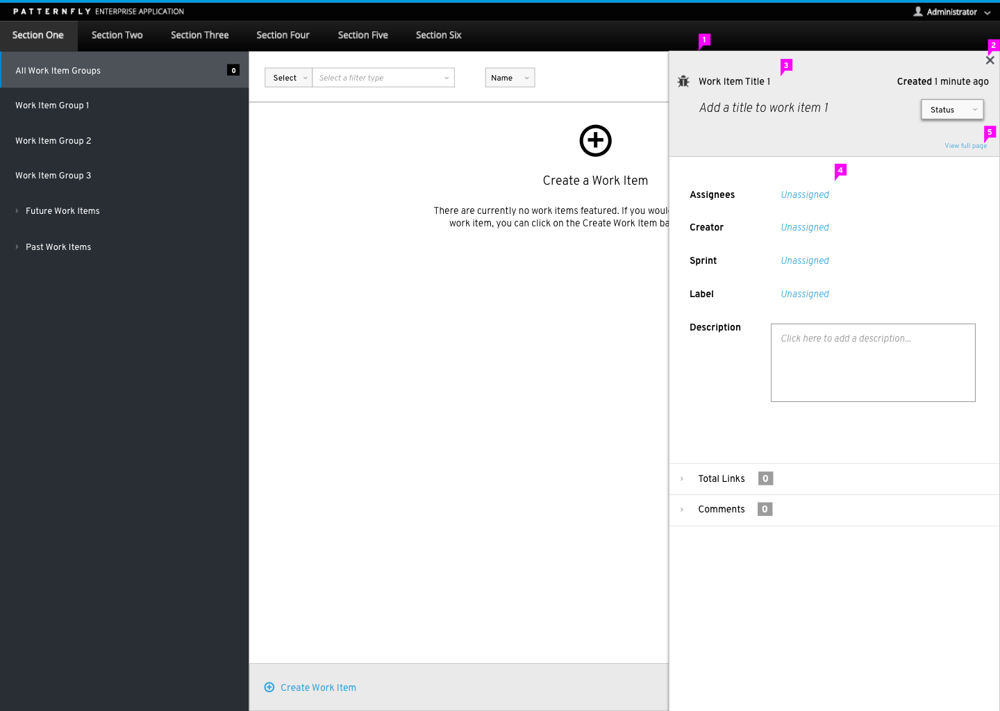

# Modeless Overlay

1. **Overlay Panel:** The panel itself rests right along the bottom of the top navigation but does not bleed onto the top navigation bar. There is a slight shadow around the overlay panel that helps to reinforce that it is located on top of the main page. The panel may be anchored to one side of the underlying UI (top, left, right, or bottom). The overlay panel should not cover any persistent navigational elements such as a top or side navigation bar.

2. **Close Button:** The close button allows the user to dismiss the overlay pattern. When the panel is closed, there is a slight animation that shows the overlay panel sliding back into the side it was anchored on.

3. **Title Area:** The primary name of the selected object helps to identify what is being shown on the panel and is featured at the top of the panel.

4. **Content Area:** Object specific content such as descriptive title, date, status, product owner, collaborators, description, etc. could live here.

5. **View Full Page:** If a user needs to view the details featured on the panel in a larger environment, the user can extend the panel to be a full page. Once the full page has been activated, the user can get back to the standard view of the overlay panel by clicking on a button entitled "View Standard Page". This will return the modeless overlay back to its original state.

1. **Content Body:** The overlay panel may be used with a variety of different views such as list, table, or card view. When using the overlay panel in different types of content views, the user still has the ability to interact with the page underneath of the panel and can adjust the content of the panel by selecting a different object from the underlying page. The user can use their mouse or keyboard to change the content of the overlay panel.

**Page Behavior:**

Vertical Navigation: If the content of the panel extends past the initial frame of the window a vertical scrollbar should be enabled.

Horizontal Scrollbar: In the case of the modeless overlay panel, a horizontal scrollbar should not be used.  

# Modeless Overlay- Mobile

1. **Accessing the Overlay Panel:** On mobile, the user can access the overlay panel by creating a new object from the main underlying UI.

2. **Overlay Panel Behavior:** On mobile, the overlay panel would extend out to be full screen. The overlay panel should act as an extension of the underlying UI. It presents more detailed information about an object that was featured in the underlying UI. When the overlay panel is open, it should be the only element that the user can interact with. In order to access the underlying UI, the user must exit the overlay panel.

3. **Object Specific Content:** Within each object, the user can input and attach object specific content.

4. **Dropdown Content:** When the user selects a piece of object specific content, that information is displayed underneath of the title of the content type.  

5. **Exiting the Overlay Panel:** In order to exit the overlay panel, the user can click the back button and that will take them back to the underlying UI.

6. **Selecting Object Content:** When the underlying UI is populated with object content, the user can select an individual object and open the overlay panel that way. The overlay panel will show information regarding the selected object.

7. **Object Content:** The user can view general object information from the overlay panel.
